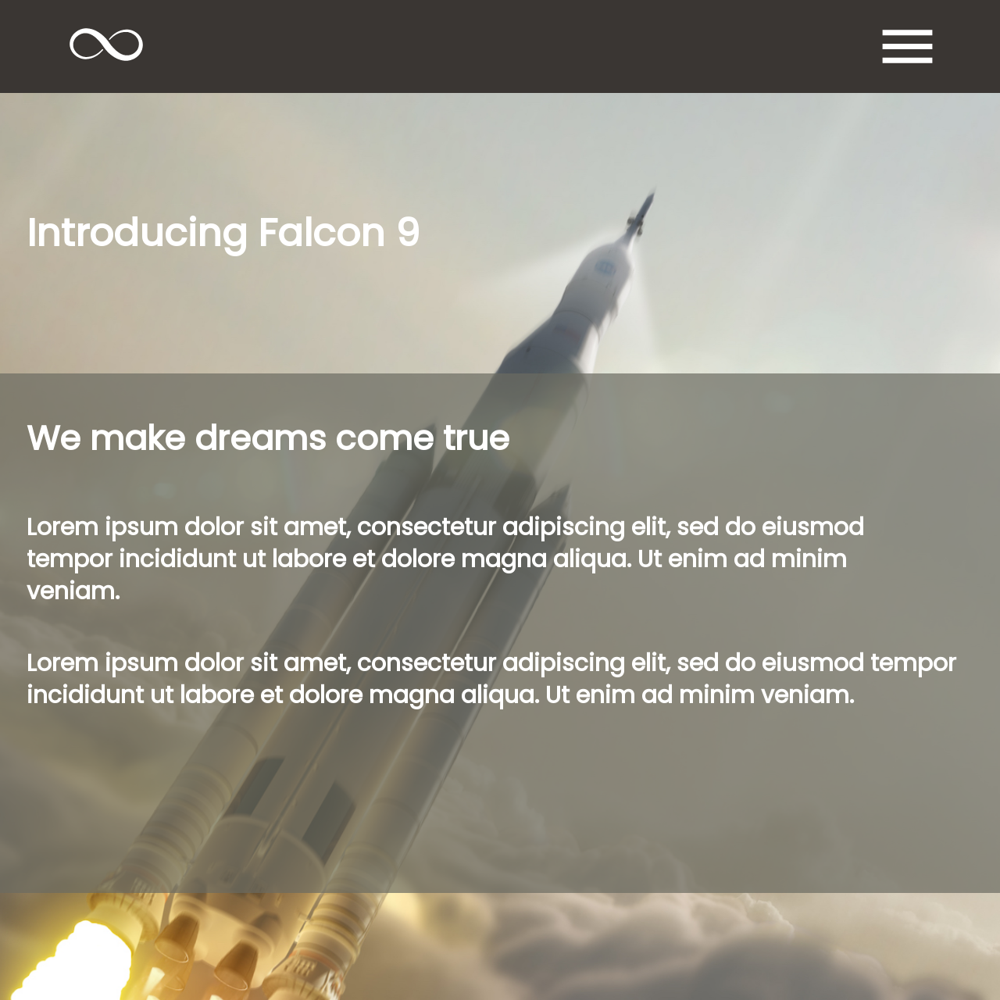

# Infinity

> CSS Show-Off Page Written For Concordia University

<div align='center'>
  
</div><br>

## Demo

[View the Live Demo](https://andrewbaldwin44.github.io/Infinity/)

## Features

1. Fully responsive design. Enjoy the site on any device!

## Screenshot


## Deploy the project

__Clone the repo to your local machine using the terminal__:
```
$ git clone git@github.com:andrewbaldwin44/Infinity.git
```

*Then Open the `index.html` Project File in Your Browser*

### Technologies Used:

- CSS
- HTML

## Author

👤 **Andrew Baldwin**

- Github: [@andrewbaldwin44](https://github.com/andrewbaldwin44)
